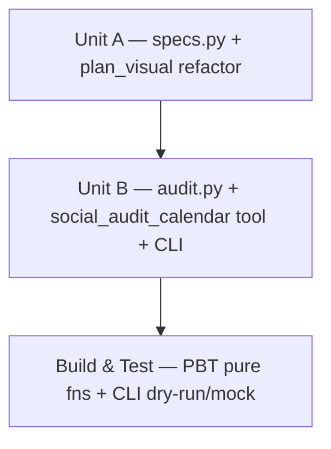

# Workflow Plan & Code-Generation Plan — Social Calendar Post Audit

**Phase**: INCEPTION → Workflow Planning → (into) CONSTRUCTION
**Requirements**: approved 2026-07-25 · **Extensions**: Security No / Resiliency No / PBT Partial

## Stage decisions (adaptive)
- **User Stories** — skipped (internal tooling, single stakeholder; acceptance criteria already in
  requirements §12).
- **Application Design** — folded into the taxonomy analysis + requirements §3.1 (no new service
  layer; reuses `core.drive`, `calendar`, exporter-style resolution, preview cache).
- **Units Generation** — two units, **A before B** (B consumes A's specs).
- **Functional Design (Unit A)** — light; the design is captured in the taxonomy analysis.
- **Code Generation** — per unit, below.
- **Build & Test** — PBT (Hypothesis) for the pure functions + CLI dry-run/mock harness for I/O glue.

---

## Unit A — canonical specs + generation correction

- [x] A1. Add `content_hub/social/specs.py`: `SPECS[platform][type]` matrix (IG/FB/TikTok ×
      image_post / video_post / reel / carousel) with aspect ratio(s), min resolution, max file
      size, carousel slide caps + `CAPTIONS` (caption cap, hashtag cap, fold) — module `VERIFIED`
      + `SOURCES` (2026-07).
- [x] A2. Add resolvers `target_aspect` / `media_spec` / `caption_spec` / `classify` +
      validity/normalization map (IG non-Reel video → Reel 9:16; FB video → 16:9; TikTok single
      image → WARN; per-platform carousel caps). Pure, no I/O.
- [x] A3. Refactor `rules.plan_visual` to take `platform` (optional, legacy-preserving) and derive
      aspect from `specs`; `VisualPlan` shape identical.
- [x] A4. Update the single call site `calendar._build_job` (calendar.py:348) to pass `platform`.
- [x] A5. PBT (`tests/test_specs.py`, 19 tests, all pass) + `generate --mode dry-run` on live
      Q3_2026 (120 rows planned, no error). Confirmed: IG/TikTok video → 9:16, FB video 16:9,
      image/reel/carousel unchanged, unknown platform legacy-preserved, 2-arg calls still work.

## Unit B — the audit

- [x] B1. `content_hub/social/audit.py`: reads the live sheet via `edit_ops._load_live` +
      `cal.read_jobs()`, classifies each row (`specs.classify`), resolves the asset from
      Generated/Created Asset Link.
- [x] B2. Asset inspection: `drive.download_bytes` + Pillow (`_image_dims`) / imageio-ffmpeg
      (`_video_dims`); file size from Drive `size` metadata; carousel → per-slide by image mime,
      worst-case rollup + slide-count check; Failed / recorded-awaiting / no-link → asset NA.
- [x] B3. Caption checks: length vs cap, hashtag count (caption + First-comment column), fold
      preview, empty-caption WARN — from `specs.caption_spec`.
- [x] B4. Verdict model: per-check PASS/WARN/FAIL/NA + reasons; per-row worst-wins overall +
      summary tally.
- [x] B5. Write-back (live only): `Audit Results` column (added `audit_results` alias to the
      reader); never touches Status/machine columns, no collision with generate's `[auto]` note.
- [x] B6. Three modes (dry-run=no download/no write, mock=inspect/no write, live=inspect+write) +
      `statuses` filter (default: all rows).
- [x] B7. `social_audit_calendar` MCP tool in `server.py` + `social audit` CLI subcommand.
- [x] B8. PBT for pure verdict/caption/aspect helpers (`tests/test_audit.py`); end-to-end
      `--mode dry-run` (120 rows) then `--mode mock` (120 assets measured) on live Q3_2026.

## Build & Test
- [x] T1. Added `requirements-dev.txt` (`pytest` + `hypothesis`) + `tests/` (test_specs.py 19,
      test_audit.py 14 — 33 total, all pass).
- [x] T2. CLI harness run: `social audit Q3_2026 --mode dry-run` → `--mode mock` (clean, exit 0);
      documented in CLAUDE.md. Fixed a Windows CLI stdout-encoding bug (force UTF-8) found during T2.
