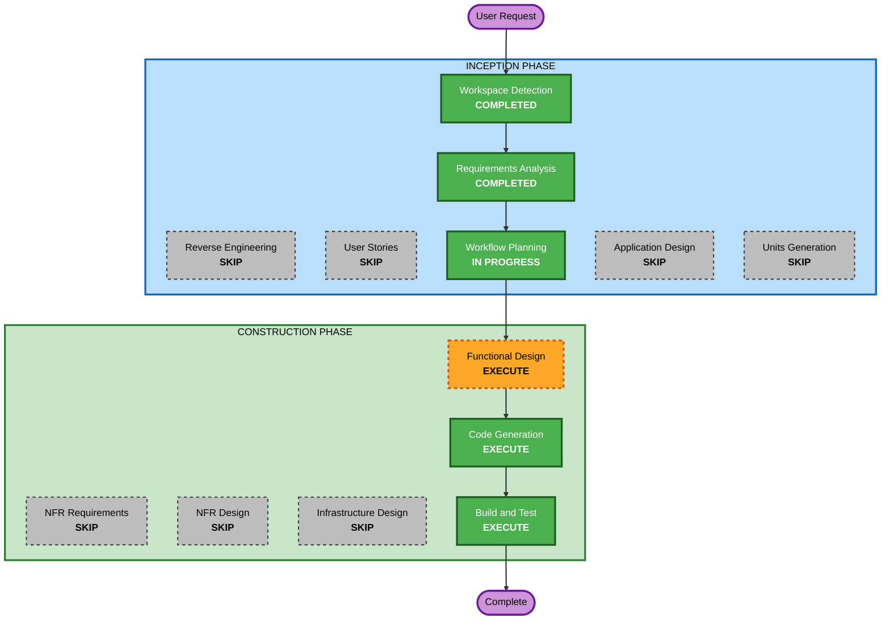

# Execution Plan — Preview Platform Simulators

**Feature**: true-to-life Instagram / Facebook / TikTok feed simulators in the social-calendar
preview page.
**Date**: 2026-07-26
**Requirements**: [../requirements/preview-simulators/requirements.md](../requirements/preview-simulators/requirements.md)

---

## Detailed Analysis Summary

### Transformation Scope (Brownfield)
- **Transformation Type**: Single component change — no architectural, infrastructure, or
  deployment-model change.
- **Primary Changes**: `content_hub/social/preview.py` — the HTML/CSS/JS template `_PAGE` and the
  card/grid rendering helpers. A new simulator overlay is added; the standalone IG Grid view is
  removed and re-homed inside the Instagram simulator.
- **Related Components**: documentation only — `README.md` (preview section) and `CLAUDE.md`
  (architecture map line for `preview.py`).

### Change Impact Assessment
- **User-facing changes**: **Yes** — a new simulator surface in the review page, and the removal
  of the existing "IG Grid" chip (its function moves into the IG simulator's Profile tab).
- **Structural changes**: **No** — no new package, module, or service; everything lives in the
  existing `social/preview.py`.
- **Data model changes**: **No** — no sheet schema change, no new columns, no reader changes. The
  simulator renders the same `Job` fields the review feed already uses.
- **API changes**: **No** — the `social_preview_calendar` MCP tool and the `social preview` CLI
  keep their existing signatures (`calendar_id`, `version`, `--out`, `--no-cache`,
  `--no-publish`). No new parameters.
- **NFR impact**: **Yes** — page weight is the binding constraint (NFR-2). The current Q3_2026
  preview is ~10 MB of inlined data URIs; the simulators must reuse those, not duplicate them.

### Component Relationships
- **Primary Component**: `content_hub/social/preview.py` — Major change
- **Shared Components (read-only consumers, unchanged)**:
  - `content_hub/social/calendar.py` — supplies `Job` rows. *No change.*
  - `content_hub/social/rules.py` — Drive layout / plan resolution. *No change.*
  - `content_hub/core/drive.py` — asset fetch + `file_id_from_link`. *No change expected;*
    a read-only helper may be reused for the video-streaming URL form.
  - `content_hub/core/config.py` — brand avatar, cache dir. *No change.*
- **Dependent Components**:
  - `server.py` (`social_preview_calendar` tool) — *no change*, signature unchanged.
  - `content_hub/cli.py` (`social preview`) — *no change*, flags unchanged.
  - The **Apps Script web app** that serves the page and provides `setPostStatus` /
    `getPostStatuses` / `getViewerInfo` — *no change required*, but is a **regression surface**
    (FR-11) because the new overlay shares the page with those handlers.
- **Supporting Components**: `tests/` — property tests exist for pure logic only; any new pure
  helper (deterministic engagement derivation) gets coverage per the Partial PBT setting.

### Risk Assessment
- **Risk Level**: **Low–Medium**. Low because the change is confined to one file that produces a
  disposable artifact (the page is rebuilt on demand; nothing persists). Medium only because of
  two specific unknowns: the Drive inline-video mechanism (ASSUMPTION-2) and the page-weight
  budget (NFR-2).
- **Rollback Complexity**: **Easy** — one file, one commit, `git revert`. No migration, no
  external state, nothing written to Drive or the sheet that would need undoing.
- **Testing Complexity**: **Moderate** — the output is a browser artifact, so correctness is
  partly visual. Mitigated by building locally with `--no-publish` and asserting on the emitted
  HTML (element counts, absence of the removed grid, output size) rather than eyeballing alone.

---

## Workflow Visualization



### Text alternative (always included)

```
INCEPTION
  Workspace Detection ...... COMPLETED
  Reverse Engineering ...... SKIP (targeted analysis of the preview subsystem instead)
  Requirements Analysis .... COMPLETED (approved 2026-07-26)
  User Stories ............. SKIP
  Workflow Planning ........ IN PROGRESS (this document)
  Application Design ....... SKIP
  Units Generation ......... SKIP
CONSTRUCTION
  Functional Design ........ EXECUTE (minimal depth)
  NFR Requirements ......... SKIP
  NFR Design ............... SKIP
  Infrastructure Design .... SKIP
  Code Generation .......... EXECUTE
  Build and Test ........... EXECUTE
OPERATIONS
  Operations ............... PLACEHOLDER
```

---

## Phases to Execute

### 🔵 INCEPTION PHASE
- [x] Workspace Detection (COMPLETED)
- [x] Reverse Engineering (SKIPPED)
  - **Rationale**: Full RE artifacts are not warranted for a single-file change. Targeted
    analysis of `preview.py` and `specs.py` was performed and is recorded in `audit.md` — the
    same approach approved for the previous feature.
- [x] Requirements Analysis (COMPLETED — approved 2026-07-26)
- [x] User Stories (SKIPPED)
  - **Rationale**: Internal tooling with a single stakeholder; `requirements.md` already carries
    per-requirement acceptance criteria, which is what stories would have contributed.
- [x] Workflow Planning (IN PROGRESS — this document)
- [ ] Application Design — **SKIP**
  - **Rationale**: No new component, service, or module boundary. The work extends the existing
    `preview.py` renderer. There is no service layer to design and no cross-component contract
    to define.
- [ ] Units Generation — **SKIP**
  - **Rationale**: Single package, single file, UI-only — explicitly a skip condition in the
    stage rules. Sequencing is handled inside the Code Generation plan's phases instead of
    through formal units.

### 🟢 CONSTRUCTION PHASE
- [ ] Functional Design — **EXECUTE** (minimal depth)
  - **Rationale**: One decision is expensive to get wrong and must be settled before coding:
    **how the simulators reuse the already-inlined data URIs** without re-emitting them
    (NFR-2 — naïve duplication roughly doubles a 10 MB file). Two smaller pure-logic items ride
    along: deterministic engagement-count derivation from Row ID (FR-10) and the post→surface
    routing rules (FR-6). Everything else is presentational and needs no design document.
- [ ] NFR Requirements — **SKIP**
  - **Rationale**: NFRs are already enumerated in `requirements.md` §4 and inherited from the
    project's standing invariants. No tech-stack selection is required — no new dependency, no
    new runtime.
- [ ] NFR Design — **SKIP**
  - **Rationale**: NFR Requirements skipped; the one NFR with design weight (page size) is
    folded into Functional Design.
- [ ] Infrastructure Design — **SKIP**
  - **Rationale**: No infrastructure. The artifact is a static HTML file; there is no deployment,
    no cloud resource, and no networking to specify.
- [ ] Code Generation — **EXECUTE** (ALWAYS)
  - **Rationale**: Implementation planning and code generation needed.
  - **Planned phases** (within the single Code Generation stage):
    1. **Shell** — overlay container, platform tabs, chassis + toggle, `Esc`/close, mirrored
       status filter; removal of the IG Grid chip and `#grid` section.
    2. **Surfaces** — the five feed renderers: IG Feed, IG Profile (absorbing `_grid_cell`),
       IG Reels, Facebook, TikTok.
    3. **Fidelity** — hover metadata overlay, deterministic engagement counts, inline video
       streaming with the offline/blocked fallback.
    4. **Docs** — `README.md` + `CLAUDE.md` updates.
- [ ] Build and Test — **EXECUTE** (ALWAYS)
  - **Rationale**: Build, test, and verification needed.

### 🟡 OPERATIONS PHASE
- [ ] Operations — PLACEHOLDER
  - **Rationale**: Future deployment and monitoring workflows. Not applicable — this feature
    produces a local artifact and optionally uploads it to the existing Drive folder.

---

## Validation Strategy

The preview command has no `dry-run`/`mock`/`live` triad (it neither spends credits nor mutates
the sheet), so validation uses the local-build path:

```powershell
python -m content_hub.cli social preview Q3_2026 --no-publish
```

This builds against the **live** calendar and real Drive assets but writes only a local file —
nothing is uploaded and nothing is changed on Drive or in the sheet. Publishing to Drive is a
separate, deliberate run without `--no-publish`.

**Quality gates**:
1. `pytest tests/` — the existing 45 tests still pass, plus coverage for any new pure helper.
2. Local build succeeds and exits 0 against the live Q3_2026 calendar.
3. **Output size within budget** — compare against the current ~10 MB baseline; NFR-2 target is
   under 15% growth. Measured, not assumed.
4. **Removal verified** — no "IG Grid" chip or `#grid` section remains in the emitted HTML.
5. **Regression check** — the Apps Script handlers (`setPostStatus`, `getPostStatuses`,
   `getViewerInfo`) and the review feed's filters, carousels, and status pills are intact in the
   emitted page.
6. **Video fallback** — confirm a post degrades to poster + Drive link when streaming is
   unavailable, with no broken frame.

---

## Estimated Effort

- **Stages to execute**: 3 (Functional Design, Code Generation, Build and Test)
- **Stages skipped**: 7 (Reverse Engineering, User Stories, Application Design, Units Generation,
  NFR Requirements, NFR Design, Infrastructure Design), plus Operations as a placeholder
- **Shape of the work**: one design note, then one substantial edit to `preview.py` delivered in
  four phases, then a local build + size comparison. The bulk is CSS and template JavaScript;
  the Python surface added is small.

---

## Success Criteria

- **Primary Goal**: a reviewer can open the preview page, click **Simulator**, and see each of
  Instagram, Facebook and TikTok rendered as a realistic phone feed of that calendar's posts.
- **Key Deliverables**:
  - Simulator overlay with three platform tabs; Instagram carrying Feed / Profile / Reels
  - Phone chassis with strip-away toggle
  - Newest-first ordering, status filters carried through
  - Hover-revealed Row ID / date / status
  - Deterministic simulated engagement counts
  - Inline Drive video with graceful fallback
  - IG Grid removed and re-homed
  - Updated `README.md` and `CLAUDE.md`
- **Quality Gates**: the six listed under Validation Strategy.
